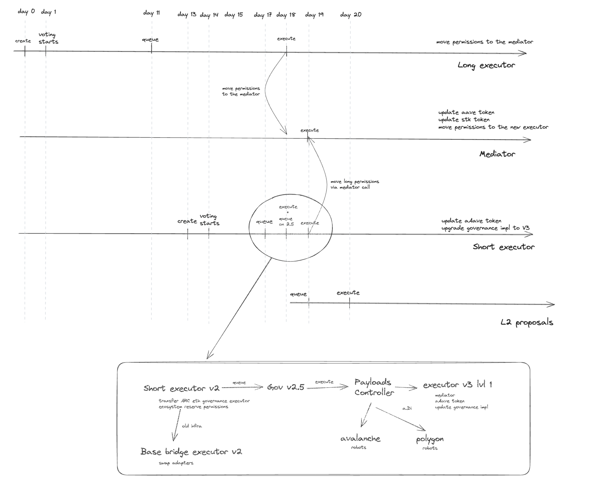

## Migration Governance v2→v2.5→v3

This repository contains payloads which are necessary for migration of all the Aave deployments from governance v2 to v2.5 and then to v3.

To migrate to Governance v2.5 the short proposal will move all the permissions to the new lvl1 executors across all the networks.

Activating Aave Governance v3 requires passing both Level 1 (Short) and Level 2 (Long) proposals on Aave Governance v2, but as the execution of both should be atomic, the global procedure needs to be more sophisticated than usual.

The following diagram gives an overview of how this process will be.


## Governance V2.5

This is an intermediate step to activate a.DI and move all the permissions to the new short executors across all the networks.

### List of contracts and actions:

- [Level 1 (Short executor) proposal, Ethereum](./src/contracts/governance2.5/EthShortMovePermissionsPayload.sol)

  - Change implementation of the Governance V3 contract to V2.5.
  - Fund CCC contract on a.DI from Aave Collector.
  - Fund execution robot.
  - Migrate all “minor” permissions of stkAAVE to the Governance v3 Level 1 Executor.
  - Migrate all GHO permissions to the Governance v3 Level 1 Executor.
  - Migrate all permissions of Aave v1 Ethereum to the Governance v3 Level 1 Executor.
  - Migrate all permissions of Aave v2 Ethereum to the Governance v3 Level 1 Executor.
  - Migrate all permissions of Aave v2 Ethereum AMM to the Governance v3 Level 1 Executor.
  - Migrate all permissions of Aave v3 Ethereum to the Governance v3 Level 1 Executor.
  - Migrate permissions of Aave MerkleDistributor (rescue mission) to the Governance v3 Level 1 Executor.
  - Migrate admin of LendToAaveMigrator to the Governance v3 Level 1 Executor.
  - Migrate permissions of Balancer v1 ABPT to the Governance v3 Level 1 Executor.
  - Transfer the ownership of the Aave Swapper contract to the Governance v3 Level 1 Executor.
  - Transfer the ownership of the Aave Collector Polygon→Ethereum bridge to the Governance v3 level 1 Executor.
  - Start migrating the admin role of Governance v2 Level 1 Executor to the Governance v3 Level 1 Executor.
  - Change ownership of Governance v3 Level 1 Executor to the Governance v2 Payloads Controller.

- [Polygon PoS](./src/contracts/governance2.5/PolygonMovePermissionsPayload.sol)

  - Fund Gelato for Aave gas tank.
  - Fund CCC contract on a.DI from Aave Collector.
  - Fund execution robot.
  - Migrate all permissions of Aave v2 Polygon to the Governance v3 Level 1 Executor.
  - Migrate all permissions of Aave v3 Polygon to the Governance v3 Level 1 Executor.
  - Transfer the ownership of the Aave Merkle Distributor contract to the Governance v3 Level 1 Executor.

- [Avalanche](./src/contracts/governance2.5/ArbMovePermissionsPayload.sol)

  - Fund CCC contract on a.DI from Aave Collector.
  - Fund execution robot.
  - Migrate all permissions of Aave v2 Avalanche to the Governance v3 Level 1 Executor.
  - Migrate all permissions of Aave v3 Avalanche to the Governance v3 Level 1 Executor.
  - Transfer the ownership of the Aave Merkle Distributor contract to the Governance v3 Level 1 Executor.
  - Migrate permissions of Proof of Reserve to the Governance v3 Level 1 Executor.

- [Arbitrum](./src/contracts/governance2.5/ArbMovePermissionsPayload.sol)

  - Fund execution robot.
  - Migrate all permissions of Aave v3 Arbitrum to the Governance v3 Level 1 Executor.

- [Optimism](./src/contracts/governance2.5/OptMovePermissionsPayload.sol)

  - Fund execution robot.
  - Migrate all permissions of Aave v3 Optimism to the Governance v3 Level 1 Executor.
  - Transfer the ownership of the Aave Merkle Distributor contract to the Governance v3 Level 1 Executor.

- [Metis](./src/contracts/governance2.5/MetisMovePermissionsPayload.sol)

  - Migrate all permissions of Aave v3 Metis to the Governance v3 Level 1 Executor.

- [Base](./src/contracts/governance2.5/BaseMovePermissionsPayload.sol)
  - Migrate all permissions of Aave v3 Base to the Governance v3 Level 1 Executor.

## Governance V3

Final step to migrate to Governance V3.

### List of contracts and actions:

- [Mediator contract](./src/contracts/Mediator.sol). In order to execute sync/atomically both Level 1 and Level 2 proposals, we have created the so-called mediator smart contract, which will receive permissions from the Level 2 executor (long), allowing for the Level 1 executor to do its own execution in sync.
  This is mandatory, because in any situation of Level 1 passing and Level 2 not (or vice versa), the whole Aave Governance v2 & v3 systems will not be operative.

- [Level 2 (Long executor) proposal, Ethereum](./src/contracts/governance3/EthLongV3Payload.sol).

  - Transfer the proxy admin permissions from the AAVE token to the ProxyAdmin Level 2 contract.
  - Transfer the ownership of the ProxyAdmin Level 2 contract to the Mediator.
  - Transfer the pendingAdmin role of Governance v2 Level 2 Executor to the Governance v3 Level 2 Executor.
  - Change ownership of Governance v3 Level 2 Executor to the Mediator contract.

- [Level 1 (Short executor) proposal, Ethereum](./src/contracts/EthShortV3Payload.sol)

  - **Trigger the execution of the Mediator.**
  - Upgrade the implementation of the Governance V3 to the final version.
  - Transfer Governance v3 proxy admin from Executor level 1 to Executor level 2.
  - Accept the admin role of Governance v2 Level 1 Executor to the Governance v3 Level 1 Executor.
  - Upgrade aAave implementation.
  - Migrate and fund keepers.

- [V2 Short executor proposal, Ethereum](./src/contracts/EthShortV2Payload.sol)

  - Migrate proxy admin and owner of the Ecosystem Reserve.
  - Change ethereum executor on ARC to Governance v3 Level 1 Executor.
  - **Trigger the execution of the V3 Short Payload.**

- [Base](./src/contracts/BaseSwapsPayload.sol)

  - Change the owner of the swaps adapter to the new executor.

- [Avalanche](./src/contracts/AvalancheFundRobotPayload.sol)

  - Fund robots.

- [Polygon](./src/contracts/PolygonFundRobotPayload.sol)

  - Fund robots.

## Setup

```sh
cp .env.example .env
forge install
```

## Security

- Internal testing and review by the BGD Labs team.
  - [Test suite](./tests/)

<br>

## Copyright

Copyright © 2023, Aave DAO, represented by its governance smart contracts.

Created by [BGD Labs](https://bgdlabs.com/).

[MIT license](./LICENSE)
